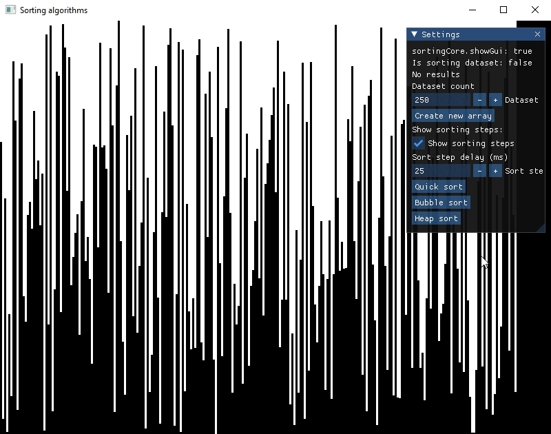

# Sorting-algorithms

## Table of contents

- [Overview](#overview)
- [My process](#my-process)
    - [Built with](#built-with)
- [Credits](#credits)

## Overview

Simple app showing different sorting algorithms. 

- Change dataset length
- Regulate sort step speed

### Sort algorithms:

- Quick sort
- Bubble sort
- Heap sort

## My process

### Built with

- C++
- Makefile
- [SFML](https://github.com/SFML/SFML)
- [ImGui](https://github.com/ocornut/imgui)

## Credits

[Github](https://github.com/IlyaChichkov)
[Email](mailto:ilya.chichkov.dev@gmail.com)